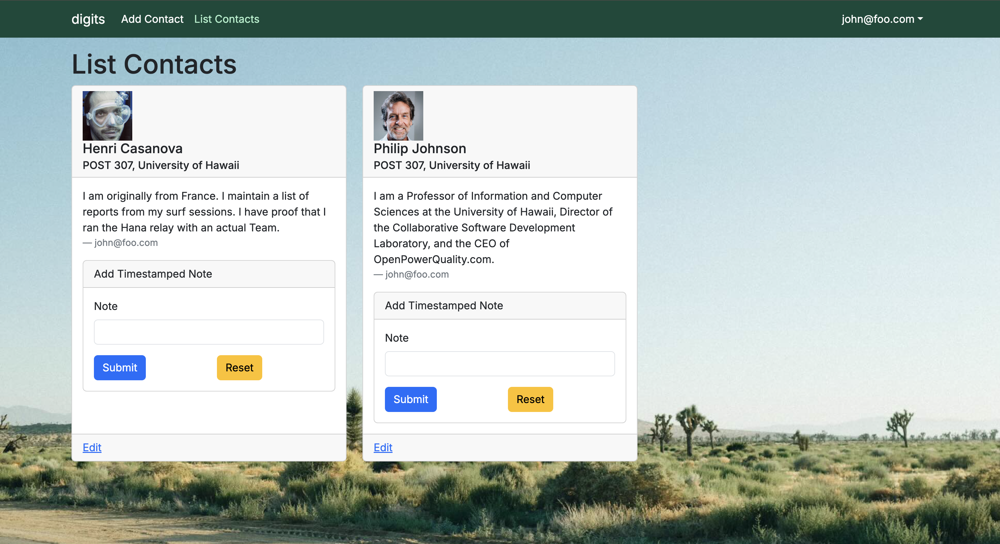
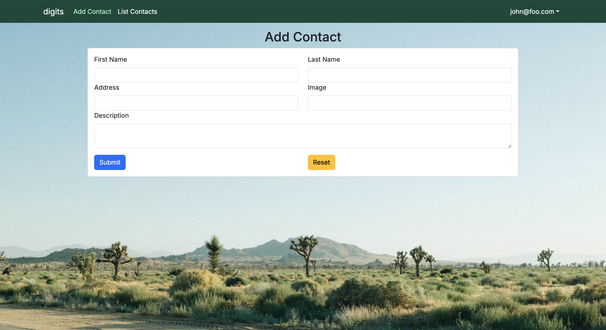
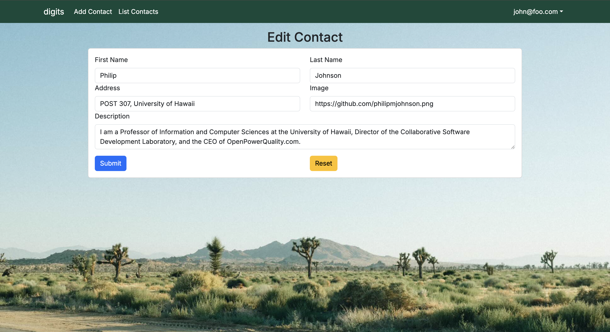
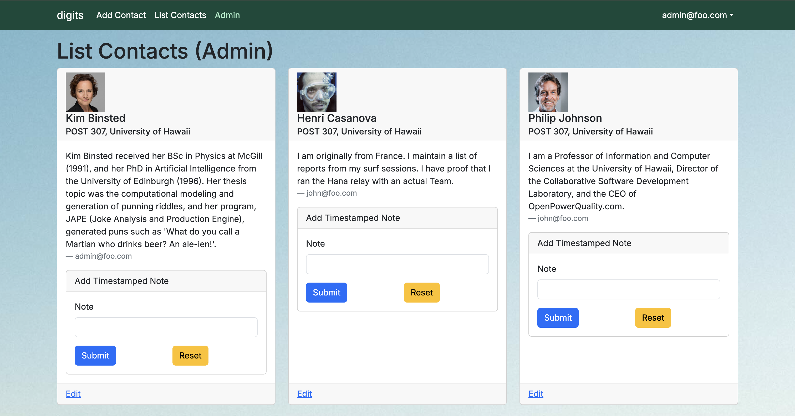

# Digits Sematic UI

Digits is an application that holds contact information of professors of the University of Hawai`i to be easily accessed.
I allows users to
- Register an account
- Create and manage contacts
- Add a set of timestamped notes regarding their interactions with each contact

## Installation

First, [install PostgreSQL](https://www.postgresql.org/download/). Then create a database for your application.

```

$ createdb nextjs-application-template
Password:
$

```

Second, go to [https://github.com/zeldaco/digits.git](https://github.com/zeldaco/digits.git), and click the "Use this template" button to create a new repository. 

Third, cd into the directory of your local copy of the repo, and install third party libraries with:

```

$ npm install

```

Fourth, create a `.env` file from the `sample.env`. Set the `DATABASE_URL` variable to match your PostgreSQL database that you created in the first step. See the Prisma docs [Connect your database](https://www.prisma.io/docs/getting-started/setup-prisma/add-to-existing-project/relational-databases/connect-your-database-typescript-postgresql). Then run the Prisma migration `npx prisma migrate dev` to set up the PostgreSQL tables.

```
$ npx prisma migrate dev

```

Then seed the database with the `/config/settings.development.json` data using `npx prisma db seed`.

```
$ npx prisma db seed

```

## Running the system

Once the libraries are installed and the database seeded, you can run the application by invoking the "dev" script.

```
$ npm run dev

```

### Viewing the running app

If all goes well, the template application will appear at [http://localhost:3000](http://localhost:3000).

### Application functionality

The application implements a simple CRUD application for managing "Stuff", which is a PostgreSQL table consisting of a name (String), a quantity (Number), a condition (one of 'excellent', 'good', 'fair', or 'poor') and an owner.

By default, each user only sees the Stuff that they have created. However, the settings file enables you to define default accounts. If you define a user with the role "admin", then that user gets access to a special page which lists all the Stuff defined by all users.

#### Landing page


The next step is to use the Login menu to either Login to an existing account or register a new account.

#### Login page

Clicking on the Login link, then on the Sign In menu item displays this page:


#### Register page

Alternatively, clicking on the Login link, then on the Sign Up menu item displays this page:


#### Landing (after Login) page, non-Admin user

Once you log in (either to an existing account or by creating a new one), the navbar changes as follows:



#### Add Contacts page

After logging in, here is the page that allows you to add new contacts:



#### List Contacts page

After logging in, here is the page that allows you to list all the contacts you have created:


You click the "Edit" link to go to the Edit Contacts page, shown next.

#### Edit Contact page

After clicking on the "Edit" link associated with an item, this page displays that allows you to change and save it:



#### Landing (after Login), Admin user

You can define an "admin" user in the settings.json file. This user, after logging in, gets a special entry in the navbar:


### Admin Mode

When logged in as an Admin, users will have access to a special NavBar link that shows all Contacts assoicated with all users.



